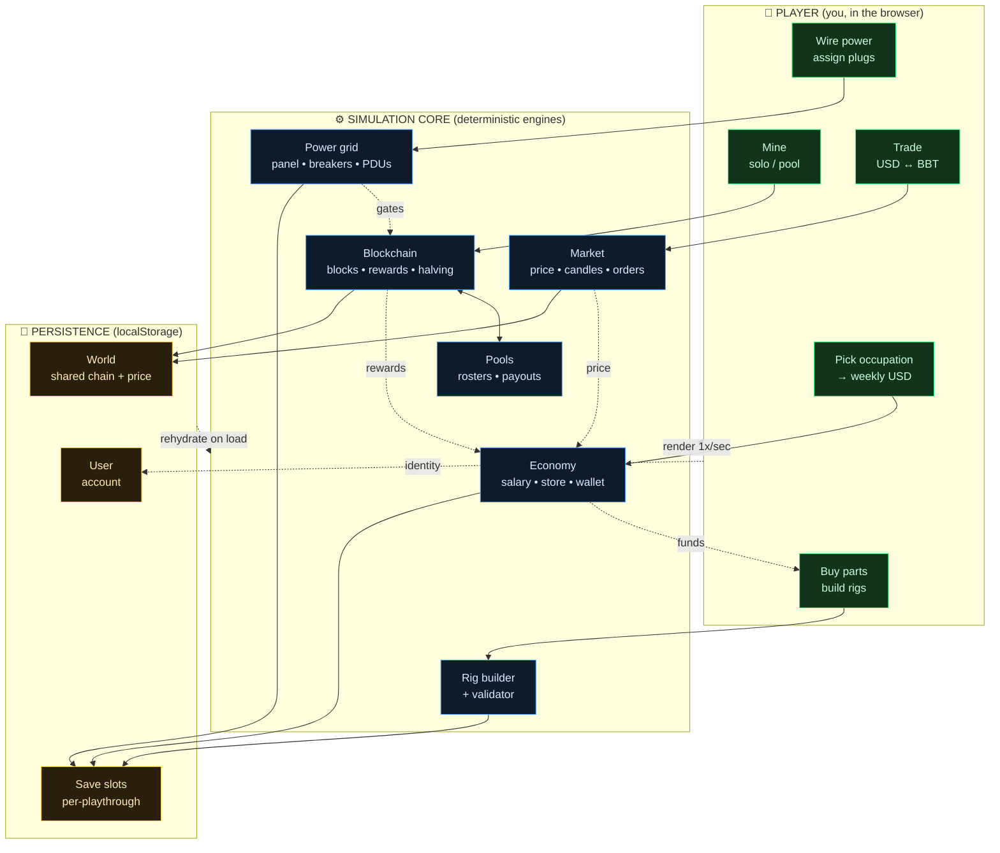

# Rig Runner — *Miner's Life*

> A browser-based crypto-mining tycoon simulation. Take a minimum-wage job, buy
> GPUs, build and wire real rigs, survive the electrical panel, trade your coin,
> join a pool, and grow from a single dorm-room rig into a multi-site operation —
> all in a self-contained set of HTML and JavaScript files with **zero build step
> and zero backend.**

<p>
  
  
  
  
</p>

Rig Runner is a **single-player, client-side game**. Everything — the economy,
the deterministic blockchain, the market candles, the power grid — runs in your
browser and persists to `localStorage`. There is no server to stand up, no
package to install, no API key to configure. Open `index.html` and play.

---

## Table of contents

- [Quick start](#quick-start)
- [What the game is](#what-the-game-is)
- [Operational view (OV-1)](#operational-view-ov-1)
- [Architecture](#architecture)
  - [Design philosophy](#design-philosophy)
  - [The three-layer model](#the-three-layer-model)
  - [Load order & global namespaces](#load-order--global-namespaces)
  - [The simulation tick](#the-simulation-tick)
  - [Deterministic engines (no RNG state saved)](#deterministic-engines-no-rng-state-saved)
  - [Persistence model](#persistence-model)
  - [The power/electrical subsystem](#the-powerelectrical-subsystem)
- [Repository structure](#repository-structure)
- [Engine module reference](#engine-module-reference)
- [Data & balancing (CSV-editable)](#data--balancing-csv-editable)
- [Extending the game](#extending-the-game)
- [Contributing](#contributing)
- [Roadmap](#roadmap)
- [Disclaimer](#disclaimer)
- [License](#license)

---

## Quick start

**Option A — just open it.** Because the game is pure client-side, you can open
`index.html` directly in most browsers and it will run.

**Option B — serve it locally (recommended).** Browsers apply stricter security
rules (CORS) to `file://` pages, and the engine files load as separate
`<script src>` includes. Serving over HTTP avoids any edge-case blocking:

```bash
# Python 3 (bundled on macOS/Linux, easy on Windows)
python3 -m http.server 8000
# then open http://localhost:8000
```

```bash
# Node alternative, if you prefer
npx serve .
```

No dependencies, no `npm install`, no compilation. The only "tooling" in the
whole project is an optional `node --check` pass used to lint the JavaScript
before shipping a release (see [Contributing](#contributing)).

**System requirements:** any modern evergreen browser (Chrome, Edge, Firefox,
Safari). Desktop or mobile — the UI is responsive and touch-aware.

---

## What the game is

You start broke. You pick an **occupation** (50 real-world jobs, from fast-food
worker to physician) that pays a **weekly salary in USD**. You spend that USD in
a **parts store** — 49 historically-modeled GPUs plus cases, motherboards, CPUs,
memory, boot drives, risers, PSUs and fans — and **assemble validated rigs**
(a legal rig needs a case, a matching motherboard, CPU, memory, a boot drive,
risers, a PSU, and at least two GPUs).

Then the interesting part: **you have to power them.** Each location (dorm →
garage → mining shed) has a real **electrical topology** — a service panel,
breakers, kilowatt meters, and PDUs with a fixed number of plugs at specific
amperages and voltages. You manually assign each rig to a plug. Overload a
circuit and the **breaker trips** — three stages in series (PDU → meter →
panel), each with manual reset. A rig only produces hashrate when it is
**plugged in, switched on, and not downstream of a tripped breaker.**

Mining pays out in **BBT**, the in-game coin, against a **deterministic
simulated blockchain** (~381 GH/s network at early-Ethereum scale, 8 pools,
~10-second blocks, ~4-year halving, 5 BBT block reward). You can **solo mine**
or **join a pool**. You **trade USD↔BBT** on an exchange with candlestick charts
(1m/5m/1h/1d/1w), limit and market orders, and tiered maker/taker fees.

It is a **tycoon/management sim about the *operational reality* of mining** —
capital, power, heat, and uptime — not a clicker and not financial software.

---

## Operational view (OV-1)

The OV-1 is the "big picture" — the actors, the systems they touch, and the
flows between them. Everything in the diagram happens inside the browser.



**How to read it:** the player (green) takes actions that drive the simulation
core (blue). The core's engines are deterministic and talk to each other — most
importantly, the **power grid gates the blockchain** (no delivered power → no
hashrate → no reward), and **rewards feed back into the economy**. All durable
state lands in `localStorage` (amber) across three keys, and is rehydrated into
the engines on load. The UI simply **renders the current state once per second**.

If your target reader can't render Mermaid, the same OV-1 is provided as a
standalone SVG at [`docs/OV1.svg`](docs/OV1.svg) and reproduced in
[`docs/ARCHITECTURE.md`](docs/ARCHITECTURE.md).

---

## Architecture

### Design philosophy

Four constraints shaped every decision in this codebase:

- **No backend, ever.** The entire game is static files. This makes it trivially
  hostable (GitHub Pages, any static host, or a local file), trivially
  forkable, and free to run. The "server" is the player's own browser.
- **No build step.** No bundler, no transpiler, no framework. The engine is
  plain ES-that-runs-in-a-browser JavaScript loaded via `<script>` tags. What
  you see in the repo is exactly what runs. This keeps the barrier to
  contribution near zero.
- **Determinism over stored randomness.** The blockchain and the market are
  *functions of time and a seed*, not simulations whose state must be saved
  tick-by-tick. Close the tab for a week, reopen it, and the chain has advanced
  to exactly where it should be — because height is computed from elapsed time,
  and every block's contents are re-derivable from a seeded PRNG. This is the
  single most important architectural idea in the project (see
  [Deterministic engines](#deterministic-engines-no-rng-state-saved)).
- **Separation of engine from presentation.** The `engine/` modules know
  nothing about the DOM. They are pure logic and data. `game.html` is the only
  file that touches the screen. In principle you could drive the same engine
  from a different front-end (a CLI, a native app, a test harness) without
  changing a line of engine code.

### The three-layer model

```
┌─────────────────────────────────────────────────────────────┐
│  PRESENTATION LAYER            game.html  (~2,000 lines)      │
│  • all DOM, CSS, and rendering    • the 1-second tick loop    │
│  • bottom-nav tabs & screens      • wires engines together    │
│  • reads/writes localStorage      • owns global mutable state │
└───────────────────────────────┬─────────────────────────────┘
                                 │ calls into ↓  (never the reverse)
┌───────────────────────────────┴─────────────────────────────┐
│  ENGINE LAYER                  engine/*.js  (8 modules)       │
│  • pure logic + embedded data     • deterministic PRNGs       │
│  • no DOM, no localStorage        • each module ≈ one domain  │
│  chain · power · electrical · parts · market · pools · …      │
└───────────────────────────────┬─────────────────────────────┘
                                 │ mirrors ↓
┌───────────────────────────────┴─────────────────────────────┐
│  DATA / SOURCE-OF-RECORD       docs/*.csv                     │
│  • human-editable balancing spreadsheets                     │
│  • NOT fetched at runtime — mirrored into the engine as JS    │
└──────────────────────────────────────────────────────────────┘
```

The golden rule: **dependencies point downward only.** `game.html` imports the
engines; the engines never reach up into the UI. This is what keeps the engine
testable in isolation and the whole thing comprehensible.

### Load order & global namespaces

`game.html` includes the eight engine modules as ordinary scripts *before* its
own inline `<script>`. Order matters because later modules and the game glue
reference constants and functions defined earlier:

```html
<script src="engine/chain.js"></script>       <!-- blockchain + mock data source -->
<script src="engine/power.js"></script>        <!-- watts, heat, kWh, price drift  -->
<script src="engine/locations.js"></script>    <!-- dorm/garage/shed definitions    -->
<script src="engine/parts.js"></script>        <!-- store catalog + rig validator   -->
<script src="engine/occupations.js"></script>  <!-- jobs + weekly salary             -->
<script src="engine/market.js"></script>       <!-- candles + market events         -->
<script src="engine/pooldash.js"></script>     <!-- pool rosters + summaries         -->
<script src="engine/electrical.js"></script>   <!-- topology + breaker/trip model    -->
<!-- …then the big inline game script -->
```

Each module attaches its constants and functions to the global scope (this is a
browser, and there is no module bundler by design). The **presentation layer**
then owns a small set of mutable globals that hold the live game state:

| Global   | Type              | Meaning                                                        |
|----------|-------------------|----------------------------------------------------------------|
| `WORLD`  | object            | Shared world: the deterministic `chain` + `econ` (BBT/USD price). |
| `SLOT`   | object            | The **active save slot** — occupation, wallet, rigs, power wiring, settings. |
| `RIGS`   | array             | The player's rigs in the current slot (convenience handle).    |
| `APP`    | object (getters)  | A thin, read-through facade exposing `chain`/`econ`/`settings` to older code paths. |
| `SRC`    | object            | A **mock data source** (`makeMockSource`) that presents the chain as if it were a live node — `getPlayer()`, `getNetwork()`, `getStats()`. |

`SRC` is a deliberate seam: the UI reads network/player facts through it, so the
deterministic chain can masquerade as a "real" data feed and could later be
swapped for an actual source without touching render code.

### The simulation tick

There is exactly **one heartbeat**, set up once:

```js
setInterval(tick, 1000);   // render once a second
```

Each `tick()` (in `game.html`) does, in order:

1. **`refreshThrottle()`** — recompute which rigs are actually receiving power
   (walks every location's plug assignments and breaker trips).
2. **Enforce power on state** — any rig that is `MINING`/`STARTUP` but no longer
   powered is forced to `OFFLINE`. *(This is the v0.9.2 power-gating fix.)*
3. **`setPlayerHashRate(...)`** — the player's hashrate is the sum of only the
   *live* (powered, mining) rigs.
4. **Accrue power usage** — add this interval's kWh from real elapsed wall-clock
   time.
5. **`syncWorld()`** — drift the BBT price and **advance the blockchain to the
   current time** (catching up any blocks that "happened" while away).
6. **`processSalary()`** — deposit weekly pay when a real week has elapsed.
7. **`processLimitOrders()`** — fill any resting exchange orders the price crossed.
8. **`save()` + `render()`** — persist state and repaint the active tab.

Because steps 5–6 are time-driven rather than tick-count-driven, the game is
correct whether it ticked 3,600 times in an hour or was closed the whole time.

### Deterministic engines (no RNG state saved)

This is worth its own section because it's the cleverest part of the design.

**The blockchain is a pure function of time.** `chain.js` fixes a genesis
timestamp and a block time. The current height is simply:

```
height(now) = floor((now − genesisMs) / blockTimeMillis)
```

Every block's "contents" (who won it, the mock block hash) are produced by a
**seeded PRNG** (`mulberry32`) keyed on the block height. So block #48,213 always
resolves to the same winner and hash, on any machine, without ever storing block
#48,213 anywhere. When you return after a gap, `syncToTime()` walks from the last
processed height to the height-for-now, crediting rewards for any blocks your
rigs would have won — with a cap per call so a very long absence is caught up in
bounded chunks.

**The market works the same way.** `market.js` derives each minute's price
return from a seed built from the genesis time and the minute index, so the
candlestick history is reproducible and continuous across sessions — candles are
*computed*, not *logged*.

The payoff: **save files are tiny and robust.** They store your decisions (rigs,
wiring, wallet, occupation) — not the second-by-second state of a simulation.
The world is always re-derivable.

### Persistence model

Three `localStorage` keys, all namespaced and versioned (`:v1`) so the schema
can evolve without silently corrupting old saves:

| Key                         | Holds                                                       | Scope                  |
|-----------------------------|-------------------------------------------------------------|------------------------|
| `rigrunner:world:v1`        | The shared `chain` state + economy (price, last sync).      | One shared world.      |
| `rigrunner:user:v1`         | The account/user record.                                    | One user.              |
| `rigrunner:slot:<n>:v1`     | A full save slot: occupation, wallet, rigs, power wiring, per-slot settings. | Multiple playthroughs. |

The **world is shared across slots** (the chain and price are "the market
everyone lives in"), while **each slot is an independent playthrough**. Saving is
just `JSON.stringify` into the relevant keys; loading rehydrates the globals.

### The power/electrical subsystem

The most distinctive system in the game deserves a map. Two modules cooperate:

- **`power.js`** — the *physics*: watts per rig at a given overclock level, watts→BTU
  heat, kWh accrual, energy cost, and BBT price drift.
- **`electrical.js`** — the *grid*: the fixed `POWER_TOPOLOGY` per location and the
  breaker model.

```
                    ┌──────────────────────────────────────┐
                    │  POWER_TOPOLOGY[location]  (fixed)     │
                    │                                        │
   Service Panel ───┤  panel (e.g. 200A)                     │
        │           │    └─ breakers (e.g. 8× 30A / 240V)    │
        ▼           │         └─ kilowatt meters (LCD)       │
   ┌─────────┐      │              └─ PDUs (6× C19 each)     │
   │ breaker │      │                   └─ plugs (C13/C19)   │
   └────┬────┘      └──────────────────────────────────────┘
        ▼
   ┌─────────┐   3-STAGE SERIES TRIP MODEL
   │  meter  │   A rig is powered  ⟺  plugged in
   └────┬────┘                     ∧  its PDU switch is on
        ▼                          ∧  no breaker upstream (PDU→meter→panel) is tripped
   ┌─────────┐
   │   PDU   │   Loads use the NEC-style 80% continuous-load rule
   └────┬────┘   (usable watts = amps × volts × 0.80). Exceed it → trip.
        ▼
   ┌─────────┐
   │  plug   │──▶  RIG  (draws rigWatts; produces hash only if powered)
   └─────────┘
```

At each tick, `refreshThrottle()` calls `evaluateTrips()` (which decides what
trips given current loads) and `computePower()` (which decides which plugs are
actually energized), then records every un-powered rig in a throttle set.
`rigThrottled(rig)` is the single source of truth the rest of the game consults.

Locations scale up as you progress:

| Location | Service | Circuits                         | PDUs | Plugs |
|----------|---------|----------------------------------|------|-------|
| Dorm     | 20A/120V| 2× C13                           | —    | 2     |
| Garage   | 2× 30A/240V | two circuits                 | 2 (6× C19 each) | 12 |
| Shed     | 200A    | 8× 30A/240V (4 left + 4 right)   | 8 (4× C19 each) | 48 |

---

## Repository structure

```
rig-runner/
├── index.html              # TITLE SCREEN. Image-map menu (Start / Load / Leaderboards).
│                           #   Entry point — links through to game.html.
├── game.html               # THE GAME. ~2,000 lines: all UI, CSS, rendering, the tick
│                           #   loop, persistence, and the glue that drives the engines.
│                           #   This is the presentation layer in its entirety.
│
├── engine/                 # THE SIMULATION. Pure logic + embedded data. No DOM.
│   ├── chain.js            #   Deterministic blockchain: genesis, height-from-time,
│   │                       #     seeded block winners, rewards, halving, pool payouts,
│   │                       #     and makeMockSource() (the data-feed facade).
│   ├── power.js            #   Physics: rig watts by overclock, watts→BTU heat, kWh,
│   │                       #     energy cost, room temp, BBT price drift.
│   ├── electrical.js       #   Grid: POWER_TOPOLOGY per location + 3-stage breaker/
│   │                       #     trip model (computePower, evaluateTrips).
│   ├── locations.js        #   The three sites (dorm/garage/shed), shop order, and
│   │                       #     default rig factory.
│   ├── parts.js            #   Store catalog (49 GPUs + all components) and the rig
│   │                       #     validator (validateRig) + GPU stat helper.
│   ├── occupations.js      #   50 jobs with annual/weekly USD salary + lookup.
│   ├── market.js           #   Deterministic price: seeded minute returns, market
│   │                       #     events, and multi-interval candle builder.
│   └── pooldash.js         #   Procedural pool rosters (miner handles/rig names) and
│                           #     pool summary stats.
│
├── assets/                 # Pixel-art PNGs: title screen, locations, and the
│                           #   fuse-box / kilowatt-meter / PDU art for the Power tab.
│
├── docs/                   # DOCUMENTATION & BALANCING (human-facing).
│   ├── ARCHITECTURE.md     #   Deep-dive companion to this README's Architecture section.
│   ├── OV1.svg             #   The OV-1 operational view as a standalone vector image.
│   ├── parts_pricing.csv   #   Source-of-record for the parts catalog (mirrors parts.js).
│   └── occupations.csv     #   Source-of-record for salaries (mirrors occupations.js).
│
├── CHANGELOG.md            # Versioned history (Keep a Changelog format).
├── README.md               # You are here.
├── LICENSE                 # See the License section — update before publishing.
└── .gitignore              # Editor/OS cruft, node_modules.
```

---

## Engine module reference

A one-screen tour of each module — its job, its notable exports, and its size.
None of these touch the DOM or `localStorage`.

### `chain.js` — deterministic blockchain (~340 lines)
The heart of the sim. Fixes `GENESIS_MS` and a ~10s block time; global network
≈ 381 GH/s. Key functions: `createNetwork()`, `heightForTime()` /
`timeForHeight()`, `syncToTime()` (catch-up with a per-call block cap),
`processBlock()`, `pickWinner()` (seeded), `currentBlockReward()` /
`rewardAtHeight()` (halving), `maybePayPool()`, and `makeMockSource()` which
exposes `getPlayer()/getNetwork()/getStats()` plus `setPlayerHashRate()` and
`setRewardMode()`. Uses `mulberry32` seeded on height for reproducibility.

### `power.js` — physics & economics of a rig (~76 lines)
`rigWatts()` and `rigPowerHash()` scale draw and hashrate by overclock level
(`low`/`normal`/`high`); `wattsToBtu()`, `kwh()`, `powerCost()`, `efficiency()`,
`roomTempF()` model heat and cost; `driftPrice()` nudges the BBT/USD price. A
`PARASITIC_W` accounts for the non-GPU rig overhead (mobo/CPU/etc).

### `electrical.js` — the grid & breakers (~174 lines)
Declares `POWER_TOPOLOGY` (panel → breakers → meters → PDUs → plugs per
location) and enforces it. `circuitSafeW()` applies the **80% continuous-load
rule** (`SAFE_FACTOR = 0.80`); `computePower()` resolves which plugs are
energized given assignments and trips; `evaluateTrips()` decides what trips
under load. `locationPlugCount()` reports capacity.

### `locations.js` — sites & rig defaults (~53 lines)
`LOCATIONS` (dorm/garage/shed), `SHOP_ORDER`, and `makeLocationRigs()` /
`defaultRig()` to seed a location's starting rig(s).

### `parts.js` — catalog & rig validation (~74 lines)
`GPU_PARTS` (49 cards with per-level hash/watts and price), plus `CASES`,
`MOTHERBOARDS`, `CPUS`, `MEMORY`, `SSDS`, `USBS`, `RISERS`, `FANS`, `PSUS`.
Constants `RIG_SLOTS`, `MIN_GPUS = 2`, `SALES_TAX = 0.05`. `validateRig()`
enforces a legal build; `gpuStats()` returns a card's mh/watts at a level;
`partById()` looks up any part.

### `occupations.js` — jobs & salary (~14 lines, data-dense)
`OCCUPATIONS` (50 jobs, annual + weekly USD). Note the salary cadence constant
`SALARY_FOLLOWUP_RATE = 0.15`: week 1 pays full salary at slot creation, then
each subsequent real week deposits 15% of the weekly figure. `occupationById()`
for lookup.

### `market.js` — deterministic price & candles (~113 lines)
`rng32()` / `minuteSeed()` make each minute's return reproducible;
`eventStateAt()` layers in market events; `buildCandles()` /
`buildCandlesInterval()` assemble OHLC data for the `INTERVALS`
(1m/5m/1h/1d/1w). No candle is stored — all are recomputed from the seed.

### `pooldash.js` — procedural pool flavor (~73 lines)
`poolRoster()` fabricates believable miner handles (from `ADJ`/`NOUN`/`RIGN`
word banks) and per-rig lines for a pool, seeded so a given pool looks
consistent; `poolSummary()` rolls up pool stats. Pure cosmetic realism.

---

## Data & balancing (CSV-editable)

The two CSVs in `docs/` are the **human-friendly source of record** for the
game's two big data tables:

- `docs/parts_pricing.csv` — every store part, its spec, power range, and price.
- `docs/occupations.csv` — every job and its annual/weekly salary.

**Important:** these CSVs are **not fetched at runtime.** The engine ships the
same data as JavaScript literals inside `parts.js` and `occupations.js` (so the
game needs no network access and no CSV parser). The workflow is:

1. Edit the CSV to rebalance prices/salaries.
2. Mirror the change into the corresponding `engine/*.js` array.

Keeping both in sync is a deliberate, low-tech choice that trades a tiny bit of
duplication for zero runtime dependencies. A contributor could add a build-time
script that regenerates the JS from the CSV — a nice first PR (see below).

---

## Extending the game

Because the layers are clean, most additions are localized:

- **Add a GPU or component** → add a row to the array in `parts.js` (and mirror
  in `docs/parts_pricing.csv`). `validateRig()` and the store pick it up
  automatically.
- **Add/retune a job** → edit `occupations.js` (+ the CSV).
- **Add a location** → extend `LOCATIONS` in `locations.js` and add its
  `POWER_TOPOLOGY` entry in `electrical.js`; drop in the art in `assets/`.
- **Add a mining pool** → extend the pool definitions in `chain.js`.
- **Rebalance the economy** → block reward/halving live in `chain.js`; price
  behavior in `market.js` + `driftPrice()` in `power.js`; salary cadence in
  `occupations.js`/`game.html`.
- **Change the physics** → overclock curves and heat in `power.js`; the 80%
  breaker headroom via `SAFE_FACTOR` in `electrical.js`.

Throughout, remember the golden rule: **engine changes stay in `engine/`; only
`game.html` should touch the DOM.**

---

## Contributing

Contributions are welcome. The project intentionally has **no build tooling**,
so the loop is fast:

1. **Fork & branch.** Use a descriptive branch name (e.g. `feat/add-rx9070`,
   `fix/breaker-reset`).
2. **Edit.** Change the relevant `engine/*.js` and/or `game.html`.
3. **Lint the JavaScript.** The one check we run before shipping is a syntax
   pass with Node (no install needed if you have Node):
   ```bash
   # check every engine module
   for f in engine/*.js; do node --check "$f" && echo "OK  $f"; done
   ```
   The inline `<script>` in `game.html` should also parse cleanly if you extract
   it; keeping logic in `engine/` makes this easy.
4. **Test by playing.** Serve locally (`python3 -m http.server 8000`) and
   exercise the path you touched. For power/economy changes, verify a full loop:
   buy → build → wire → mine → get paid.
5. **Update `CHANGELOG.md`** under a new version heading (Keep a Changelog
   format), and bump the version string in `game.html` (the `.ver` badge in the
   top bar) and the badge at the top of this README.
6. **Open a PR** describing the change and how you verified it.

**Good first issues / ideas**
- A tiny script that regenerates `parts.js`/`occupations.js` from the CSVs so
  the data has a single source.
- A headless test harness that imports the engine modules under Node and asserts
  chain determinism (same height/winner for a fixed time).
- Accessibility passes on the Power tab.

**Style:** match the surrounding code — vanilla JS, no framework, no new runtime
dependencies. Keep engine modules DOM-free.

---

## Roadmap

Indicative direction (see `CHANGELOG.md` for shipped history):

- Deeper progression between sites and larger-scale power (three-phase, sub-panels).
- More market depth (order-book visualization, volatility regimes).
- Optional cloud save / leaderboards (would introduce the project's *first*
  optional backend — kept strictly optional to preserve the no-server ethos).
- CSV→JS data generation to remove the mirror-by-hand step.

---

## Disclaimer

**Rig Runner is a game.** It is a fictional simulation for entertainment. It is
**not** financial, investment, mining, or electrical advice, and it does not
model any real cryptocurrency, exchange, or utility. "BBT" is an in-game token
with no real-world value. The electrical model is a gameplay abstraction — do
**not** treat it as guidance for real wiring, breaker sizing, or load
calculations. Consult a licensed electrician for anything involving real mains
power.

---

## License

> ⚠️ **Action needed before you open-source this.** The current `LICENSE` file
> reads *"All rights reserved. Placeholder."* — which is **not** an open-source
> license. Until you replace it, no one has the legal right to use, copy, or
> contribute to the code, which defeats the purpose of publishing.

Pick a license that matches your intent and drop its text into `LICENSE`:

- **MIT** — simplest and most permissive; maximizes adoption. Good default for a
  game you want people to freely fork and learn from.
- **Apache-2.0** — permissive like MIT but adds an explicit patent grant and
  contribution terms; a common choice for slightly more formal projects.
- **GPL-3.0** — copyleft; requires derivatives to stay open source. Choose this
  if you want forks to remain open.

A note on **assets**: your pixel art in `assets/` is your original work. Many
projects license *code* permissively (MIT) but keep *art* under a separate,
more restrictive license (e.g. CC BY-NC-ND). If that's your intent, state it
explicitly — e.g. add an `assets/LICENSE` and note the split here.

*(Once chosen, update this section and the badge at the top of the README.)*

---

<sub>Rig Runner — *Miner's Life*. Built with vanilla JavaScript, HTML5 Canvas,
and a deterministic simulation core. No backend. No build step. Just open it.</sub>
