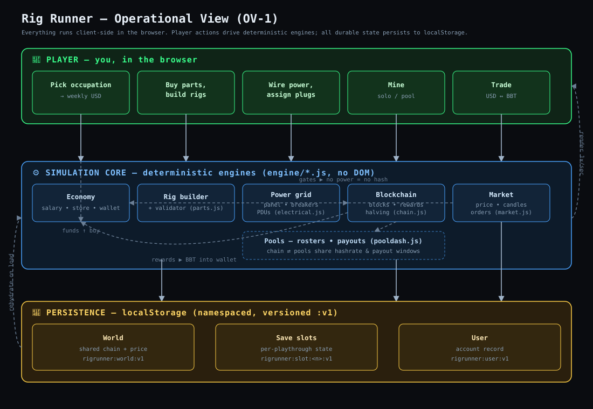

# Architecture — Deep Dive

This is the companion to the **Architecture** section of the top-level
[`README.md`](../README.md). The README gives the overview an outside reader
needs; this document is for a contributor who is about to change engine code and
wants the precise contracts, invariants, and gotchas.

---

## 1. The operational view (OV-1)



The player drives deterministic engines; the engines couple to each other (most
importantly, **power gates the blockchain**); all durable state lands in
`localStorage` and is rehydrated on load. The UI renders the current state once
per second.

---

## 2. Layering and the dependency rule

```
Presentation (game.html)  ──imports──▶  Engine (engine/*.js)  ──mirrors──▶  Data (docs/*.csv)
        ▲                                                                        
        └──────────────── renders state ; owns DOM & localStorage ─────────────┘
```

**Invariant #1 — dependencies point downward.** Engine modules must not
reference the DOM, `window`-UI globals, or `localStorage`. If you find yourself
reaching for `document` inside `engine/`, the logic belongs in `game.html`
instead, or the data it needs should be passed in as an argument.

**Invariant #2 — engines are pure w.r.t. their inputs.** Given the same
arguments (and, for time-based engines, the same timestamp + seed), a function
returns the same result. This is what makes the game re-derivable and testable.

---

## 3. Global namespaces (owned by `game.html`)

Engine modules attach their constants/functions to global scope (intentional —
there is no bundler). The presentation layer owns the mutable game state:

| Global  | Kind             | Responsibility |
|---------|------------------|----------------|
| `WORLD` | object           | Shared world: `chain` (deterministic blockchain state) and `econ` (`bbtUsd`, `lastSyncMs`). Persisted to `rigrunner:world:v1`. |
| `SLOT`  | object           | Active save slot: `occupation`, wallet/balance, `rigs`, power wiring (`plugAssign`, `trips`, per-rig `powerOn`), `poolId`, per-slot `settings`, `kwhUsed`, `lastSyncMs`. Persisted to `rigrunner:slot:<n>:v1`. |
| `RIGS`  | array            | Convenience handle to the active slot's rigs. |
| `APP`   | object (getters) | Read-through facade so older code can say `APP.chain` / `APP.econ` / `APP.settings` while the real data lives on `WORLD`/`SLOT`. |
| `SRC`   | object           | `makeMockSource(() => WORLD.chain)` — presents the chain as a data feed: `getPlayer()`, `getNetwork()`, `getStats()`, plus `setPlayerHashRate()` / `setRewardMode()`. |

`SRC` is the seam that would let a real data source replace the simulated chain
without touching render code.

---

## 4. The tick loop (the only heartbeat)

`setInterval(tick, 1000)` in `game.html`. Order is load-bearing:

| # | Step | Why it's here |
|---|------|---------------|
| 1 | `refreshThrottle()` | Recompute which rigs actually receive power (walks plug assignments + breaker trips into a throttle set). Must run first so everything downstream sees correct power state. |
| 2 | Force unpowered `MINING`/`STARTUP` rigs → `OFFLINE` | **v0.9.2 power-gating fix.** A backstop independent of whether a console is open. |
| 3 | `setPlayerHashRate(chain, networkHashFromRigs())` | Player hashrate = sum of live (powered, mining) rigs only. |
| 4 | Accrue kWh from real elapsed time | Energy cost tracks wall-clock, not tick count. |
| 5 | `syncWorld()` → `driftPrice()` + `syncToTime()` | Advance price and **catch the chain up to now**, crediting any blocks won while away (bounded per call). |
| 6 | `processSalary()` | Deposit weekly pay when a real week has elapsed. |
| 7 | `processLimitOrders()` | Fill resting exchange orders the price crossed. |
| 8 | `save()` + `render()` | Persist, then repaint the active tab. |

Because steps 5–6 are **time-driven**, the game is correct across long absences
and tab closes.

---

## 5. Determinism: the core idea

### Blockchain (`chain.js`)
- `GENESIS_MS` + block time fix the timeline. `heightForTime(now)` =
  `floor((now − genesisMs) / blockMillis)`.
- Per-block outcomes come from `mulberry32` seeded on **height** (`blockRng`), so
  block *N* always resolves identically, everywhere, with nothing stored.
- `syncToTime()` walks from last-processed height to height-for-now, calling
  `processBlock()` / `pickWinner()` and crediting rewards; a `maxBlocksPerCall`
  cap keeps a long catch-up bounded per invocation.
- Rewards: `currentBlockReward()` / `rewardAtHeight()` implement the halving;
  `maybePayPool()` handles pool payout windows.

### Market (`market.js`)
- `minuteSeed(genesisMs, minuteIndex, salt)` + `rng32` make each minute's return
  reproducible; `eventStateAt()` layers events; `buildCandlesInterval()` assembles
  OHLC for `INTERVALS` = 1m/5m/1h/1d/1w. **Candles are computed, never logged.**

**Consequence:** save files store *decisions*, not *simulation frames*. The world
is always re-derivable from time + seed. Do not "fix" this by persisting
per-block or per-candle data — it would break the model and bloat saves.

---

## 6. Persistence schema

| Key | Contents | Notes |
|-----|----------|-------|
| `rigrunner:world:v1` | `{ chain, econ:{ bbtUsd, lastSyncMs } }` | Shared across all slots — the market everyone lives in. |
| `rigrunner:slot:<n>:v1` | Full slot: occupation, wallet, rigs, wiring, settings, kwhUsed, lastSyncMs | One independent playthrough per `<n>`. |
| `rigrunner:user:v1` | Account/user record | — |

The `:v1` suffix is a **schema version**. If you change a stored shape
incompatibly, bump to `:v2` and add a migration path rather than silently
reading old data.

---

## 7. Power / electrical subsystem (the signature system)

Two cooperating modules:

- **`power.js` (physics):** `rigWatts()` / `rigPowerHash()` scale draw & hash by
  overclock level (`low`/`normal`/`high`); `wattsToBtu()`, `kwh()`,
  `powerCost()`, `efficiency()`, `roomTempF()`; `driftPrice()` for BBT/USD.
  `PARASITIC_W` covers non-GPU overhead.
- **`electrical.js` (grid):** `POWER_TOPOLOGY[location]` declares panel →
  breakers → meters → PDUs → plugs. `SAFE_FACTOR = 0.80` applies the NEC-style
  continuous-load rule via `circuitSafeW()`. `evaluateTrips()` decides what trips
  under current load; `computePower()` decides which plugs are energized;
  `locationPlugCount()` reports capacity.

**Powered predicate.** A rig is powered ⟺ it is plugged in **and** its PDU
switch is on (`powerOn !== false`) **and** no breaker upstream (PDU → meter →
panel) is tripped. `refreshThrottle()` computes this each tick and records every
un-powered rig; `rigThrottled(rig)` is the **single source of truth** the rest of
the game (hashrate, console, rendering) consults. If you add a system that
depends on "is this rig running," gate it on `rigThrottled()`, not on
`rig.state` alone.

**Topology by location**

| Location | Service | Circuits | PDUs | Plugs |
|----------|---------|----------|------|-------|
| Dorm | 20A / 120V | 2× C13 | — | 2 |
| Garage | 2× 30A / 240V | two circuits | 2 (6× C19 each) | 12 |
| Shed | 200A | 8× 30A / 240V (4 left + 4 right) | 8 (4× C19 each) | 48 |

---

## 8. Rendering model

`game.html` uses a bottom-nav tab system (`data-tab`: room, dash, explore,
stats, power, shop, settings) and a family of `render*()` functions
(`renderRoom`, `renderDash`, `renderPower`, `renderShop`, `renderStats`,
`renderExplore`, `renderSettings`, plus sub-renderers for parts/cart/owned and
the candle chart). `render()` dispatches to the active tab each tick. Rendering
reads state and paints; it does not mutate simulation state (mutation happens in
the tick steps and in user-action handlers).

---

## 9. Where things live (change-map)

| To change… | Edit… |
|------------|-------|
| A GPU/part or its price | `engine/parts.js` (+ mirror `docs/parts_pricing.csv`) |
| A job/salary | `engine/occupations.js` (+ `docs/occupations.csv`) |
| Block reward / halving / pools | `engine/chain.js` |
| Price behavior / candles | `engine/market.js` (+ `driftPrice()` in `power.js`) |
| Overclock curves / heat | `engine/power.js` |
| Breaker headroom / topology | `engine/electrical.js` (`SAFE_FACTOR`, `POWER_TOPOLOGY`) |
| A new location | `engine/locations.js` + `engine/electrical.js` + art in `assets/` |
| Anything on screen | `game.html` only |

---

## 10. Invariants checklist (before you open a PR)

- [ ] No `document` / DOM / `localStorage` access added under `engine/`.
- [ ] Time-based logic derives from a timestamp + seed, not stored frames.
- [ ] New "is it running?" logic gates on `rigThrottled()`.
- [ ] CSV and its mirrored JS array stay in sync.
- [ ] `node --check` passes for every `engine/*.js`.
- [ ] Stored-shape changes bump the `:vN` key and migrate.
- [ ] `CHANGELOG.md` updated; version bumped in `game.html` and README badge.
